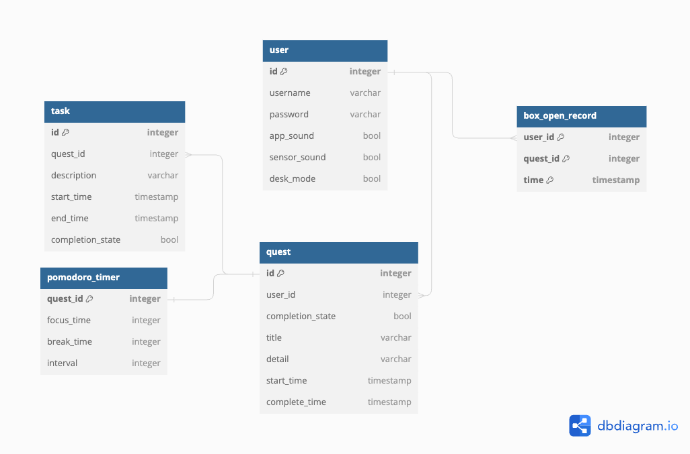

# QUIET QUEST

The Quiet Quest system is a productivity tool consisting of two main components: a box device fitted with a microcontroller and sensors, and a desktop application for task management. The box device is used to store the user’s mobile phone while they perform “quests” that they have specified in the application. On approaching or opening the box during an ongoing quest, it will alert the user with audio and light signals as a reminder that they are on a Quiet Quest. 

This is the perfect project to try out for anyone who wants to learn about using microcontrollers, sensors and connectivity between hardware components and a software application. The project also makes use of a number of tools and concepts worth getting familiar with.

The GUI is created with **JavaFX** and **Scenebuilder**. For anyone already somewhat familiar with object-oriented programming using Java, this is a nice addition to your tool kit. 

**Connectivity** between the hardware components and the software application is achieved by using **HiveMQ** as a broker, implementing the **publish-subscribe** architectural pattern. 

To be able to save user data we have set up a database with **PostgreSQL**, using **Docker** for the setup.

To ensure a stable and consistent build, we use **Gradle** for automated build and have incorporated a **CI Pipeline**. 

## Getting Started
### Installation
- [Arduino IDE](https://www.arduino.cc/en/software)
- Your IDE of choice for Java projects (we use [intelliJ](https://www.jetbrains.com/idea/) and [VSCode](https://code.visualstudio.com/))
- JavaFX SDK | [How to install and setup for intelliJ](https://www.youtube.com/watch?v=Ope4icw6bVk) (Bro Code, YouTube)
- SceneBuilder | [How to install SceneBuilder](https://www.youtube.com/watch?v=-Obxf6NjnbQ&t=239s) (Bro Code, YouTube)
- [Docker Desktop](https://www.docker.com/products/docker-desktop/)
    - Open Docker Desktop
    - In the terminal: cd into _app/docker/_
    - Enter _docker-compose up_
- [Gradle](https://gradle.org/install/) (do this _after_ installing and setting up Docker)
    - After installing Gradle, find _quietquest/app/quietquest/build.gradle_ in your project files in the IDE
    - Right-click _build.gradle_ and choose _link gradle project_
    - Run Quiet Quest from the terminal:
        - cd into _quietquest/app/quietquest/_
        - Enter _./gradlew run_ (MacOS)  or _gradlew run_ (Windows)

### Libraries

**External download and installation:**
- [Ultrasonic Ranger Sensor](https://github.com/Seeed-Studio/Seeed_Arduino_UltrasonicRanger) - v1.0.3 by Seed Studio
- [ChainableLED](https://github.com/pjpmarques/ChainableLED) - v1.3 by pjpmarques
- [Seeed Arduino LCD](https://github.com/Seeed-Studio/Seeed_Arduino_LCD) - v2.2.6 by Seeed Studio
    - note: fork from TFT_eSPI
- [Basic Color RGB Control](https://github.com/1ux/LED_RGB_Control)

**Internal installation through Ardunio IDE:**
- [Adafruit_ZeroDMA](https://github.com/adafruit/Adafruit_NeoMatrix_ZeroDMA) - v1.04 by Adafruit  
    **Dependencies:** installed by IDE
    | Library                      | Version | 
    | ---------------------------- | ------- |
    | Adafruit BusIO               | v1.16.0 |
    | Adafruit DMA neopixel library| v1.3.3  |
    | Adafruit GFX Library         | v1.11.9 |
    | Adafruit NeoPixel            | v1.12.1 |
    | Adafruit Zero DMA Library    | v1.1.3  |

- [Seed Arduino rpcWiFi](https://github.com/Seeed-Studio/Seeed_Arduino_rpcWiFi) - v1.0.7 by Seed Studio  
    **Dependencies:** installed by IDE
    | Library                      | Version |
    | ---------------------------- | ------- |
    | Seeed Arduino FS             | v2.1.1  |
    | Seeed Arduino SFUD           | v2.0.2  |
    | Seeed Arduino rpcUnified     | v2.1.4  |
    | Seeed_Arduino_mbedtls        | v3.0.1  |
    
- [PubSubClient](https://github.com/knolleary/pubsubclient) - v2.8 by Nick O'Leary

### Wio Terminal
Follow the pinout diagrams below when connecting the sensors to the mictrocontroller. 

1. I2C port:
    - [Grove - I2C Hub](https://wiki.seeedstudio.com/Grove-I2C_Hub/)
    - [Grove - Mini PIR Motion Sensor](https://www.seeedstudio.com/Grove-mini-PIR-motion-sensor-p-2930.html)
    - [Grove - Ultrasonic Ranger](https://wiki.seeedstudio.com/Grove-Ultrasonic_Ranger/)
2. Digital port (D0):
    - [Grove - Light Sensor v1.2](https://wiki.seeedstudio.com/Grove-Light_Sensor/)
3. & 4:
    - [Grove - Chainable RGB Led v2.0](https://wiki.seeedstudio.com/Grove-Chainable_RGB_LED/):
        -  Yellow cable into pin 16, D2
        - White cable into pin 18, D3
        - Black cable into pin 6, GND
        - Red cable into pin 4, 5V

## How To Use
### WIO Terminal
1. Connect to a power source via a USB-C cable.
2. Switch power on (flick button on the left side).

The Wio Terminal's screen lights up and displays labels for WiFi and MQTT connection, and sensors. Once Wifi and MQTT connection is established, confirmation of this will be displayed as well as data from the sensors. This real-time information is also displayed on the Quest Page of the desktop application.

### Box Device
The box device measures the distance to objects directly in front of it using the **Grove Ultrasonic Ranger**. This is used to determine if attempts are made to collect the phone during an ongoing quest. If an object (or person) is detected within certain ranges (0-15 cm, 16-30 cm or 31-50 cm) the box device will emit various audio and light signals to alert the user that it is not time to open the box yet.

If the box is opened during an ongoing quest, the **Grove Light Sensor v1.2** will read a light value over 15 and report this to the system, and the interruption will be noted in the ongoing quest's information.

### Establish WiFi Connection
1. Open _wio/quietquest/src/credentials/credentials.cpp_
2. Enter your WiFi SSID within the quotation marks
3. Enter your WiFi password within the quotation marks
4. Open Arduino IDE
    - Go to File/Open...
    - Open _quiet-quest/wio/quietquest/quietquest.ino_
    - Connect the WIO terminal to your computer with a USB-C cable
    - Verify
    - Upload
5. Now you can switch off the WIO terminal and disconnect it from your computer if you wish to place it further away. If you do, make sure to connect it to another power source.

Repeat these steps if you want to change the WiFi credentials later on.

### Restarting & Turning Off the WIO Terminal
Restarting or turning off the WIO Terminal disconnects it from WiFi and the MQTT Broker. To reconnect, go to the Quest page in the application and start a quest.

**Restart:** Flick the power switch towards the right.

**Turn off:** Fully flick the power switch towards the left.

### Desktop Application
1. Open Docker Desktop
2. Run the Quiet Quest application via the terminal:
    - cd into the _app/quietquest_ directory
    - Enter _./gradlew fatJar_
    - Enter _java -jar build/libs/quietquest-1.0-SNAPSHOT-fat.jar_

For a walkthrough of how to use the application, please watch the video summary in the Wiki.

## System Design
A PostgreSQL database, set up with Docker, is used for storing user and quest data. See the tables and relationships below.     

The Quiet Quest system is divided in two main subsystems: Wio Terminal together with Grove sensors, and a desktop application. These subsystems are connected via an MQTT broker, using HiveMQ. Communication between the subsystems and the MQTT broker is implemented by using the Publish-Subscribe architectural pattern. 

## Acknowledgements
The Quiet Quest system is our project for the course 'DIT113 Mini Project: System Development' at the University of Gothenburg during the spring semester 2024. Thank you to the department of Computer Science and Engineering for providing hardware and theory.

Thank you to the teaching assistants Omid Khodaparast and Michael König for their invaluable feedback and guidance throughout the project. 

## Team
|  |  |  |  |  |
| ------ | ------ | ------ | ------ | ------ |
| Julia McCall | Lian Shi | Marcus Berggren | Tanya Nordh | Emma Camén |
| Made significant contributions to the backend, UI development and gamification elements. | Made significant contributions to backend logic related to CI pipeline, MQTT broker and database. | Made significant contributions to code structure, especially relating to Arduino. | Made significant contributions to backend, UI development and audio. | Made significant contributions to the background music and visual artwork. |

_These profile pictures were generated using the GoArt AI tool, with images of the team members as prompts._

