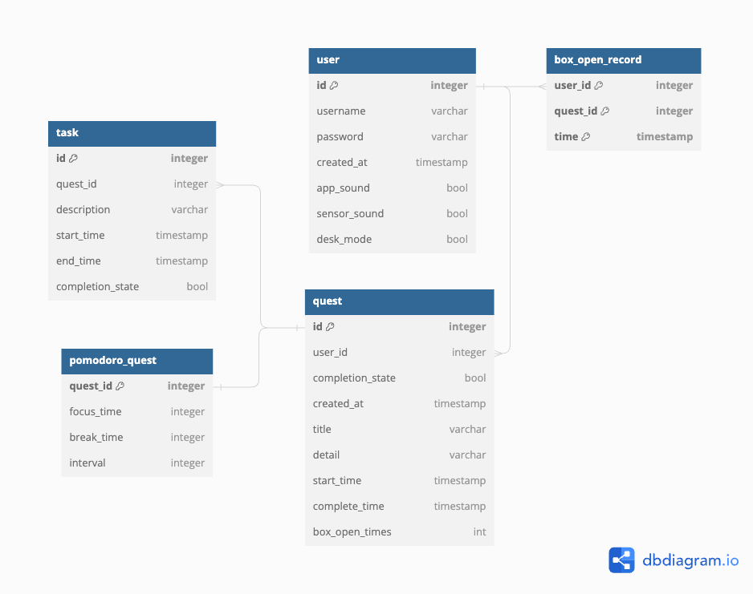

# QUIET QUEST

The Quiet Quest system is a productivity tool consisting of two main components: a box device fitted with a microcontroller and sensors, and a desktop application for task management. The box device is used to store the user’s mobile phone while they perform “quests” that they have specified in the application. On approaching or opening the box during an ongoing quest, it will alert the user with audio and light signals as a reminder that they are on a Quiet Quest. 

This is the perfect project to try out for anyone who wants to learn about using microcontrollers, sensors and connectivity between hardware components and a software application. The project also makes use of a number of tools and concepts worth getting familiar with.

The GUI is created with **JavaFX** and **Scenebuilder**. For anyone already somewhat familiar with object-oriented programming using Java, this is a nice addition to your tool kit. 

**Connectivity** between the hardware components and the software application is achieved by using **HiveMQ** as a broker, implementing the **publish-subscribe** architectural pattern. 

To be able to save user data we have set up a database with **PostgreSQL**, using **Docker** for the setup.

To ensure a stable and consistent build, we use **Gradle** for automated build and have incorporated a **CI Pipeline**. 

# Getting Started
## Install
- [Arduino IDE](https://www.arduino.cc/en/software)
- Your IDE of choice for Java projects (we use [intelliJ](https://www.jetbrains.com/idea/) and [VSCode](https://code.visualstudio.com/))
- JavaFX SDK | [How to install and setup for intelliJ](https://www.youtube.com/watch?v=Ope4icw6bVk) (Bro Code, YouTube)
- SceneBuilder | [How to install SceneBuilder](https://www.youtube.com/watch?v=-Obxf6NjnbQ&t=239s) (Bro Code, YouTube)
- [Docker Desktop](https://www.docker.com/products/docker-desktop/)
- [Gradle](https://gradle.org/install/)

## Libraries

### External download and installation:
- [Ultrasonic Ranger Sensor](https://github.com/Seeed-Studio/Seeed_Arduino_UltrasonicRanger) - v1.0.3 by Seed Studio
- [ChainableLED](https://github.com/pjpmarques/ChainableLED) - v1.3 by pjpmarques
- [Seeed Arduino LCD](https://github.com/Seeed-Studio/Seeed_Arduino_LCD) - v2.2.6 by Seeed Studio
    - note: fork from TFT_eSPI
- [Basic Color RGB Control](https://github.com/1ux/LED_RGB_Control)

### Internal installation through Ardunio IDE:
- [Adafruit_ZeroDMA](https://github.com/adafruit/Adafruit_NeoMatrix_ZeroDMA) - v1.04 by Adafruit  
    **Dependencies:** installed by IDE
    | Library                      | Version | 
    | ---------------------------- | ------- |
    | Adafruit BusIO               | v1.16.0 |
    | Adafruit DMA neopixel library| v1.3.3  |
    | Adafruit GFX Library         | v1.11.9 |
    | Adafruit NeoPixel            | v1.12.1 |
    | Adafruit Zero DMA Library    | v1.1.3  |

- [Seed Arduino rpcWiFi](https://github.com/Seeed-Studio/Seeed_Arduino_rpcWiFi) - v1.0.7 by Seed Studio  
    **Dependencies:** installed by IDE
    | Library                      | Version |
    | ---------------------------- | ------- |
    | Seeed Arduino FS             | v2.1.1  |
    | Seeed Arduino SFUD           | v2.0.2  |
    | Seeed Arduino rpcUnified     | v2.1.4  |
    | Seeed_Arduino_mbedtls        | v3.0.1  |
    
- [PubSubClient](https://github.com/knolleary/pubsubclient) - v2.8 by Nick O'Leary

## Wio Terminal
Follow the pinout diagrams below when connecting the sensors to the mictrocontroller. 

1. I2C port:
    - [Grove - I2C Hub](https://wiki.seeedstudio.com/Grove-I2C_Hub/)
    - [Grove - Mini PIR Motion Sensor](https://www.seeedstudio.com/Grove-mini-PIR-motion-sensor-p-2930.html)
    - [Grove - Ultrasonic Ranger](https://wiki.seeedstudio.com/Grove-Ultrasonic_Ranger/)
2. Digital port (D0):
    - [Grove - Light Sensor v1.2](https://wiki.seeedstudio.com/Grove-Light_Sensor/)
3. & 4:
    - [Grove - Chainable RGB Led v2.0](https://wiki.seeedstudio.com/Grove-Chainable_RGB_LED/):
        -  Yellow cable into pin 16, D2
        - White cable into pin 18, D3
        - Black cable into pin 6, GND
        - Red cable into pin 4, 5V

# System Design

_EER model of database_

_System Architecture_

# Contributions
<!---
To be added: "Profile pictures" in the same style as the badges + links to team members' gitlab profiles + description of contributions.
-->
